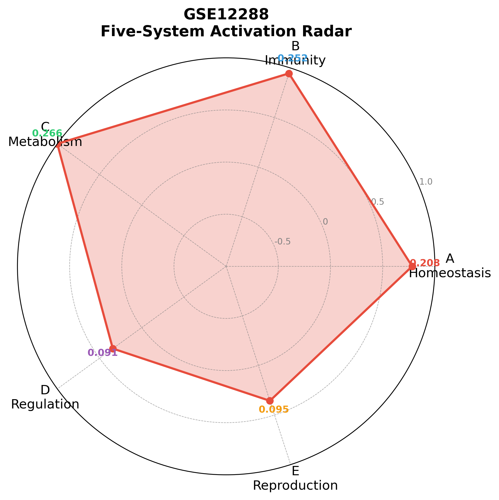
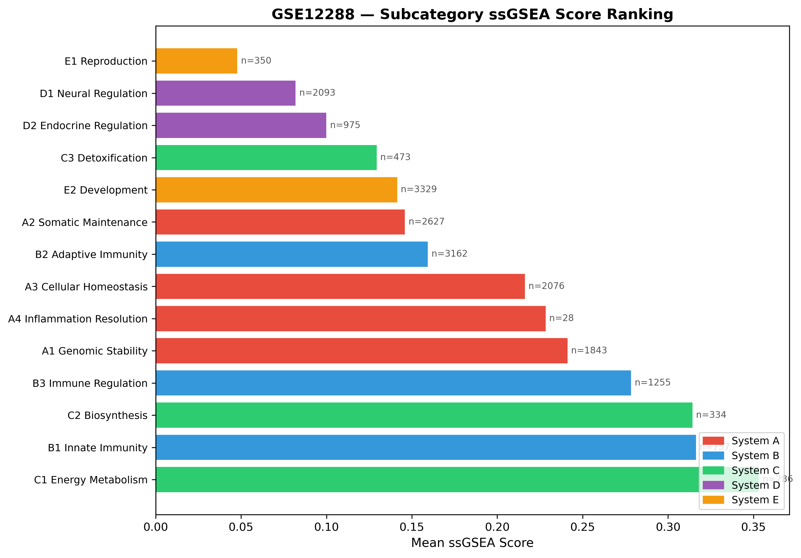
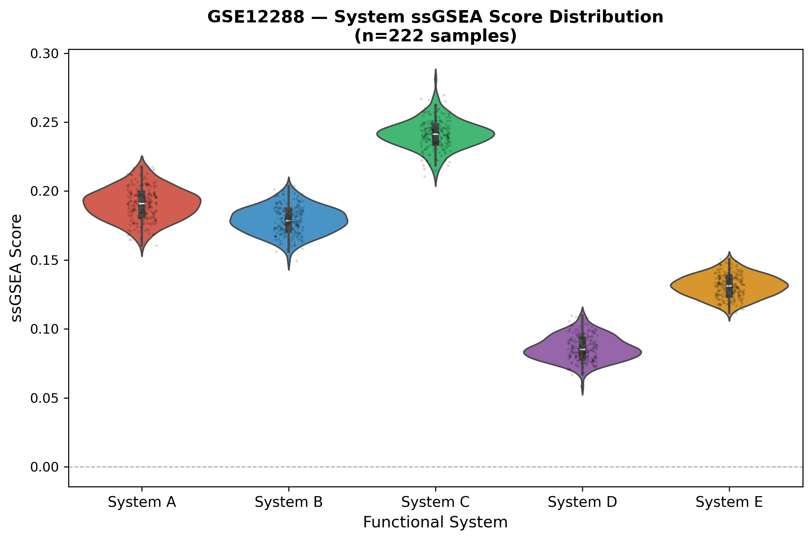

# 五维生物系统分类 · 疾病分析 Agent

基于 **LangGraph** 构建的自主疾病基因组分析智能体。Agent 能够自动选择 GEO 数据集、执行 ssGSEA 分析、生成可视化报告，并通过 LLM 解读生物学意义。

## 项目亮点

- **LangGraph 多节点工作流**：11 个节点的有向图，涵盖数据下载 → 预处理 → 分类 → ssGSEA → 可视化 → LLM 解读 → 报告导出全流程
- **自主数据集选择**：LLM 从 90+ 个人类疾病 GEO 数据集白名单中，根据已分析疾病的覆盖度和系统多样性，智能推荐下一个最有价值的数据集
- **五大生物系统分类**：基于 GO/KEGG 注释，将基因组分类为修复(A)、免疫(B)、代谢(C)、神经调节(D)、生殖发育(E) 五大系统
- **自实现 ssGSEA**：不依赖 gseapy，自行实现 single-sample GSEA 算法，对每个样本计算系统激活分数
- **DashScope LLM 集成**：通过 OpenAI 兼容接口调用 Qwen 模型，完成数据集推荐、分析策略制定、结果解读三个环节

## 架构

```
run_auto_analysis.py          # 主入口
│
├── DiseaseSelector           # 疾病选择 Agent
│   ├── 扫描已分析数据集
│   ├── 从白名单(DATASETS + geo_whitelist.csv)获取候选
│   └── LLM 推荐 / 规则引擎兜底
│
└── LangGraph 分析工作流
    ├── extract_metadata      # 提取数据集元信息
    ├── download_data         # 下载 series matrix（本地 GPL 优先）
    ├── preprocess_data       # probe → gene 表达矩阵
    ├── classify_genes        # 五大系统分类
    ├── run_ssgsea            # ssGSEA 系统激活分数
    ├── determine_strategy    # LLM 制定分析策略
    ├── generate_visualizations # 雷达图/箱线图/热图等
    ├── interpret_results     # LLM 生物学解读
    ├── generate_report       # Markdown 报告
    └── export_pdf            # 保存结果 + analysis_summary.json
```

## 快速开始

**环境要求**：Python 3.11，conda

```bash
# 1. 克隆项目
git clone https://github.com/your-username/five-system-disease-agent.git
cd five-system-disease-agent

# 2. 创建环境
conda create -n thesis_env python=3.11
conda activate thesis_env
pip install -r requirements.txt

# 3. 配置 API Key
cp .env.example .env
# 编辑 .env，填入你的 DASHSCOPE_API_KEY

# 4. 运行（Windows）
start.bat          # 激活环境并加载 .env
python run_auto_analysis.py
```

## 数据集白名单扩充

```bash
# 从 NCBI GEO 自动筛选人类表达谱数据集，追加到 data/geo_whitelist.csv
python fetch_geo_whitelist.py
```

## 项目结构

```
src/
├── agent/                    # ★ 核心 Agent 逻辑
│   ├── disease_analysis_agent.py  # LangGraph 工作流定义（11节点）
│   ├── disease_selector.py        # 疾病选择 Agent
│   ├── llm_integration.py         # DashScope LLM 封装
│   ├── plot_generator.py          # matplotlib/seaborn 可视化
│   ├── config.py                  # 数据集白名单 + 参数配置
│   ├── analysis_strategies.py     # 分析策略定义
│   ├── geo_validator.py           # GEO 数据集预验证
│   └── logger.py                  # 日志配置
├── classification/           # 五大系统基因分类器
├── analysis/                 # ssGSEA 实现、语义分析
├── preprocessing/            # GO/KEGG 注释解析
├── visualization/            # 报告导出
└── data_extraction/          # GEO 数据下载器

data/
├── gpl_platforms/            # 本地 GPL 平台注释文件
├── geo_whitelist.csv         # 自动筛选的 GEO 数据集白名单
└── validation_datasets/      # 已下载的数据集

tests/                        # 调试脚本
results/agent_analysis/       # 分析输出（报告、图表、JSON）
```

## 技术栈

| 组件 | 技术 |
|------|------|
| Agent 框架 | LangGraph |
| LLM | Qwen3.5-122B (DashScope) |
| 基因分析 | 自实现 ssGSEA |
| 数据来源 | NCBI GEO |
| 可视化 | matplotlib / seaborn |
| 基因注释 | GO / KEGG |

## 许可证

MIT

## 示例运行结果（GSE12288 · 冠状动脉疾病）

以下为对 [GSE12288](https://www.ncbi.nlm.nih.gov/geo/query/acc.cgi?acc=GSE12288)（196例冠心病外周血，GPL96平台）的完整分析示例。

### 运行过程

```
步骤 1: 疾病选择 Agent 扫描已分析数据集 → LLM 从白名单推荐 GSE12288
        推荐理由: 未覆盖的 cardiovascular 类型，196大样本，与已有代谢/感染类数据互补

步骤 2: 下载 series matrix（~12MB），从 data/gpl_platforms/ 加载本地 GPL96 注释

步骤 3: probe → gene 映射，生成 13237 genes × 222 samples 表达矩阵

步骤 4: 五大系统分类 → 8143/13237 基因匹配

步骤 5: ssGSEA 计算 14 个子类激活分数

步骤 6: LLM 制定分析策略 → 生成雷达图、柱状图、箱线图

步骤 7: LLM 解读生物学意义 → 生成 Markdown 报告
```

总耗时约 **4分钟**（含两次 LLM 调用）。

### 输出文件

| 文件 | 说明 |
|------|------|
| `results/agent_analysis/GSE12288/analysis_summary.json` | 结构化结果（ssGSEA分数、top系统、元信息） |
| `results/agent_analysis/GSE12288/GSE12288_report.md` | LLM生成的完整分析报告（含生物学解读） |
| `results/agent_analysis/GSE12288/figures/` | 可视化图表（3张） |
| `logs/auto_analysis_YYYYMMDD_HHMMSS.log` | 完整运行日志 |

### 可视化图表

**雷达图 — 五大系统激活分数**



**柱状图 — 子类激活排名（Top 14）**



**箱线图 — 系统分数分布**



### 主要发现（LLM 解读摘要）

冠心病外周血呈现显著的**代谢-免疫双重激活**模式：

- **System C（代谢）** 激活最强：C1 能量代谢(0.353)、C2 生物合成(0.314) 居所有子类之首
- **System B（免疫）** 紧随其后：B1 先天免疫(0.317)、B3 免疫调节(0.278) 高度激活
- **System D/E** 分数较低，提示外周血转录组改变集中于全身性代谢应激与固有免疫，而非神经/激素调节

> 完整报告见 [`results/agent_analysis/GSE12288/GSE12288_report.md`](results/agent_analysis/GSE12288/GSE12288_report.md)

### 日志格式示例

日志保存在 `logs/auto_analysis_YYYYMMDD_HHMMSS.log`，记录每个节点的执行状态：

```
2026-03-16 11:02:01 - INFO - LLM 推荐数据集: GSE12288
2026-03-16 11:02:01 - INFO - 推荐理由: 未覆盖的 cardiovascular 类型...
2026-03-16 11:02:28 - INFO - ✅ Series matrix 下载成功: GSE12288_series_matrix.txt.gz
2026-03-16 11:02:28 - INFO - ✓ 找到本地平台文件: GPL96-57554.txt
2026-03-16 11:02:37 - INFO - ✓ 分类完成: 8143/13237 基因匹配到基因集
2026-03-16 11:02:37 - INFO - ✓ ssGSEA 完成: 14 个子类
2026-03-16 11:03:51 - INFO - ✓ 生成图表: radar_system_scores.png
2026-03-16 11:04:43 - INFO - ✅ GSE12288 分析完成
```
