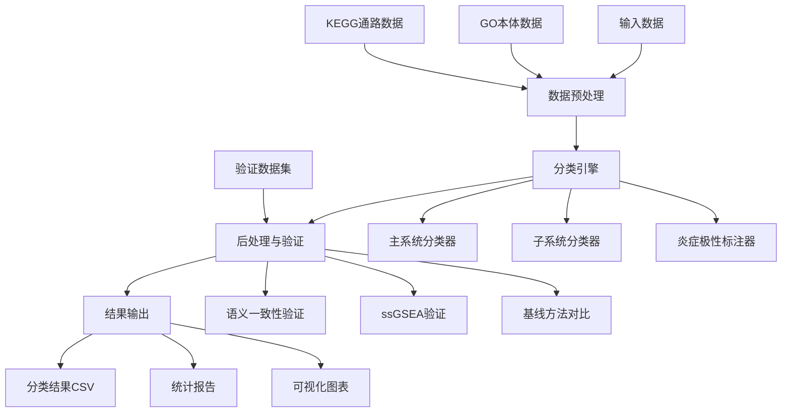

# 五大功能系统分类研究 - 设计文档

## 概述

本设计文档描述了一个基于功能目标的五大系统分类框架的技术实现。该系统将GO本体和KEGG通路数据按照生物过程的主要功能目标分类到五个核心系统中，并通过真实基因表达数据验证分类的生物学有效性。

### 核心设计原则

1. **功能目标导向**: 按照生物过程服务的主要生命任务进行分类，而非按器官、分子或解剖结构
2. **层次化分类**: 主系统(A-E) → 子系统(A1-A4, B1-B3等) → 炎症极性标注
3. **可验证性**: 通过语义一致性和真实数据验证确保分类的科学合理性
4. **可重现性**: 基于明确规则的自动化分类，支持版本控制和结果重现

## 架构

### 系统架构图



### 数据流架构

1. **输入层**: GO本体文件(go-basic.txt)、KEGG层次文件(br_br08901.txt)、验证数据集
2. **处理层**: 数据解析器、分类引擎、验证模块
3. **输出层**: 分类结果、统计报告、可视化图表

## 组件和接口

### 1. 数据预处理模块

#### GOParser类
```python
class GOParser:
    def __init__(self, go_file_path: str)
    def parse_go_terms(self) -> Dict[str, GOTerm]
    def build_dag(self) -> nx.DiGraph
    def get_ancestors(self, term_id: str) -> Set[str]
```

#### KEGGParser类
```python
class KEGGParser:
    def __init__(self, kegg_file_path: str)
    def parse_pathways(self) -> List[KEGGPathway]
    def extract_hierarchy(self) -> Dict[str, Tuple[str, str]]
```

### 2. 分类引擎模块

#### FiveSystemClassifier类
```python
class FiveSystemClassifier:
    def __init__(self, classification_rules: Dict)
    def classify_primary_system(self, entry: BiologicalEntry) -> str
    def classify_subsystem(self, entry: BiologicalEntry, primary: str) -> str
    def annotate_inflammation_polarity(self, entry: BiologicalEntry) -> str
    def apply_decision_rules(self, entry: BiologicalEntry) -> ClassificationResult
```

#### 分类规则引擎
- 基于正则表达式和关键词匹配
- 支持层次化决策树
- 可配置的优先级规则

### 3. 验证模块

#### SemanticCoherenceValidator类
```python
class SemanticCoherenceValidator:
    def calculate_semantic_similarity(self, term1: str, term2: str) -> float
    def compute_intra_system_similarity(self, system_terms: List[str]) -> float
    def compute_inter_system_similarity(self, system1: List[str], system2: List[str]) -> float
    def validate_clustering_quality(self) -> ValidationReport
```

#### ssGSEAValidator类
```python
class ssGSEAValidator:
    def compute_system_scores(self, expression_data: pd.DataFrame) -> pd.DataFrame
    def analyze_time_series(self, scores: pd.DataFrame, time_points: List) -> TimeSeriesResult
    def compare_disease_control(self, scores: pd.DataFrame, groups: List) -> ComparisonResult
```

### 4. 基线对比模块

#### PCABaseline类
```python
class PCABaseline:
    def __init__(self, n_components: int = 5)
    def fit_transform(self, go_scores: pd.DataFrame) -> pd.DataFrame
    def compare_performance(self, five_system_scores: pd.DataFrame, 
                          pca_scores: pd.DataFrame, labels: List) -> ComparisonResult
```

## 数据模型

### 核心数据结构

#### BiologicalEntry
```python
@dataclass
class BiologicalEntry:
    id: str
    name: str
    definition: str
    source: str  # 'GO' or 'KEGG'
    namespace: Optional[str]  # for GO terms
    ancestors: Set[str]  # for GO terms
    hierarchy: Optional[Tuple[str, str]]  # for KEGG pathways
```

#### ClassificationResult
```python
@dataclass
class ClassificationResult:
    primary_system: str
    subsystem: Optional[str]
    all_systems: List[str]
    inflammation_polarity: Optional[str]
    confidence_score: float
    decision_path: List[str]
```

#### ValidationResult
```python
@dataclass
class ValidationResult:
    intra_system_similarity: Dict[str, float]
    inter_system_similarity: Dict[Tuple[str, str], float]
    clustering_quality_score: float
    statistical_significance: Dict[str, float]
```

### 数据库模式

#### 分类结果表
```sql
CREATE TABLE classification_results (
    id VARCHAR(50) PRIMARY KEY,
    name TEXT,
    definition TEXT,
    source VARCHAR(10),
    primary_system VARCHAR(50),
    subsystem VARCHAR(10),
    all_systems TEXT,
    inflammation_polarity VARCHAR(20),
    confidence_score FLOAT,
    created_at TIMESTAMP
);
```

## 正确性属性

*A property is a characteristic or behavior that should hold true across all valid executions of a system-essentially, a formal statement about what the system should do. Properties serve as the bridge between human-readable specifications and machine-verifiable correctness guarantees.*

基于需求分析，以下是系统必须满足的正确性属性：

### Property 1: 系统分类完整性
*For any* 有效的生物学条目，分类器应该将其分配到五个主系统(A-E)或System 0中的一个，不应该出现未分类的条目
**Validates: Requirements 1.2**

### Property 2: GO条目过滤正确性  
*For any* GO条目集合，系统应该只处理namespace为"biological_process"且不包含"obsolete"标记的条目
**Validates: Requirements 2.1, 2.2**

### Property 3: 分类一致性
*For any* 相同的生物学条目，在多次运行中应该得到完全一致的分类结果
**Validates: Requirements 2.3**

### Property 4: 功能目标导向分类
*For any* 具有相同分子机制但不同功能目标的条目对，它们应该被分类到不同的功能系统中
**Validates: Requirements 4.1**

### Property 5: 复杂通路拆分
*For any* 包含破坏性和建设性组分的通路，系统应该将其拆分并分别标注到适当的系统中
**Validates: Requirements 4.2**

### Property 6: 炎症过程分类规则
*For any* 炎症相关过程，系统应该根据其主要功能目标(威胁清除vs结构修复)正确分配到System B或System A
**Validates: Requirements 4.3**

### Property 7: ssGSEA计算准确性
*For any* 基因表达数据和基因集，ssGSEA计算应该产生在[-1,1]范围内的富集得分
**Validates: Requirements 5.1**

### Property 8: 语义聚类质量
*For any* 有效的分类结果，系统内部的平均语义相似度应该显著高于系统间的平均语义相似度
**Validates: Requirements 6.4**

### Property 9: 子系统分类正确性
*For any* 被分类到主系统A的条目，应该进一步被正确分类到子系统A1-A4中的一个
**Validates: Requirements 11.1**

### Property 10: 炎症极性标注
*For any* 炎症相关的生物学过程，系统应该将其标注为{促炎、抗炎、促消解}中的一个类别
**Validates: Requirements 11.6**

### Property 11: System 0识别
*For any* 通用分子机制(转录、翻译、复制等)，系统应该将其正确标注为System 0而非功能系统
**Validates: Requirements 12.1**

### Property 12: 输出格式完整性
*For any* 分类结果输出，应该包含ID、名称、定义、来源、主要系统、所有系统等必需字段
**Validates: Requirements 8.1**

## 错误处理

### 输入数据错误
- **缺失文件**: 提供清晰的错误消息和建议的解决方案
- **格式错误**: 跳过无效条目并记录警告日志
- **编码问题**: 使用UTF-8编码并处理特殊字符

### 分类错误
- **无匹配规则**: 分配到"Unclassified"类别并记录详细信息
- **多重匹配**: 按照优先级规则选择主系统
- **循环依赖**: 检测GO DAG中的循环并报告错误

### 验证错误
- **数据不足**: 当样本数量不足时跳过统计检验
- **计算失败**: 提供降级的验证方法
- **内存不足**: 实现批处理和增量计算

## 测试策略

### 单元测试
- **分类规则测试**: 验证每个分类规则的正确性
- **数据解析测试**: 确保GO和KEGG数据正确解析
- **计算模块测试**: 验证ssGSEA和语义相似度计算
- **边界条件测试**: 处理空输入、极值等边界情况

### 属性测试
本系统将使用**Hypothesis**作为属性测试库，配置每个属性测试运行最少100次迭代。

每个属性测试必须包含以下格式的注释标签：
`**Feature: five-system-classification, Property {number}: {property_text}**`

#### 测试生成器设计
- **生物学条目生成器**: 生成具有不同名称、定义和层次结构的条目
- **GO条目生成器**: 生成不同命名空间和状态的GO条目
- **表达数据生成器**: 生成符合生物学约束的基因表达矩阵
- **炎症过程生成器**: 生成不同极性和功能目标的炎症相关条目

#### 关键属性测试
1. **分类一致性测试**: 相同输入产生相同输出
2. **系统完整性测试**: 所有条目都被分配到某个系统
3. **语义聚类测试**: 验证系统内外相似度关系
4. **子系统分配测试**: 验证子系统分类的正确性

### 集成测试
- **端到端流程测试**: 从原始数据到最终结果的完整流程
- **验证数据集测试**: 使用已知结果的数据集验证系统性能
- **性能对比测试**: 与PCA基线方法的对比验证

### 回归测试
- **版本兼容性测试**: 确保新版本与历史结果的兼容性
- **数据更新测试**: 验证GO/KEGG数据更新后的分类稳定性
- **参数敏感性测试**: 测试关键参数变化对结果的影响

### 测试数据管理
- **合成数据集**: 用于单元测试和属性测试的人工数据
- **标准数据集**: 用于基准测试的公开数据集
- **回归数据集**: 用于版本对比的历史数据快照